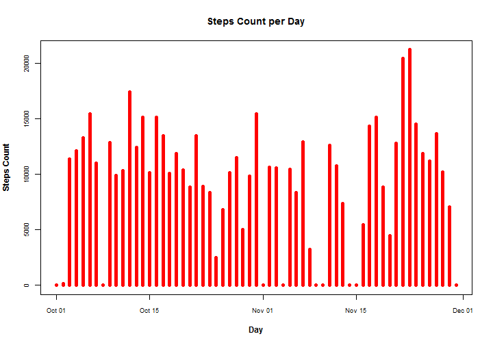
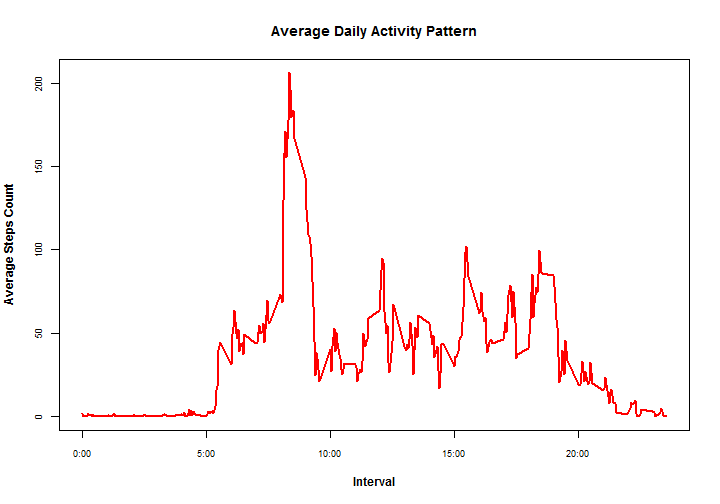
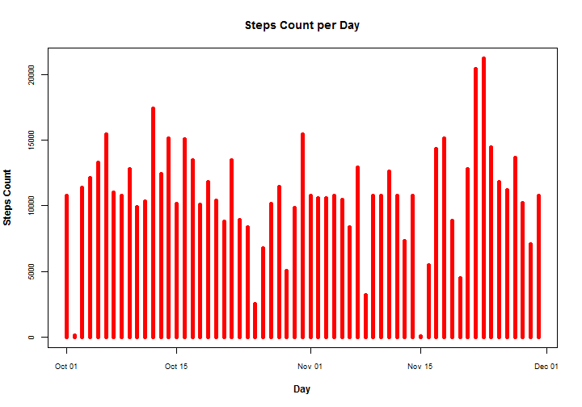
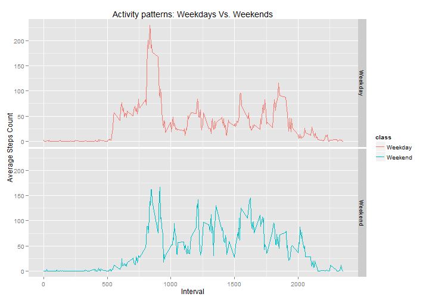

Personal Activity Monitoring - Analysis
========================================================

## 1. Introduction

It is now possible to collect a large amount of data about personal movement using activity monitoring devices such as a Fitbit, Nike Fuelband, or Jawbone Up. These type of devices are part of the "quantified self" movement - a group of enthusiasts who take measurements about themselves regularly to improve their health, to find patterns in their behavior, or because they are tech geeks.

Our report will focus on finding special patterns in their behaviors as well as interpreting the data statistically to gain some valuable insights.

## 2. Dataset

Personal activity monitoring devices collect data at 5 minute intervals through out the day. The data consists of two months of data from an anonymous individual collected during the months of October and November, 2012 and include the number of steps taken in 5 minute intervals each day.

* Dataset: [Activity monitoring data] (https://d396qusza40orc.cloudfront.net/repdata%2Fdata%2Factivity.zip)
* steps: Number of steps taking in a 5-minute interval (missing values are coded as NA)
* date: The date on which the measurement was taken in YYYY-MM-DD format
* interval: Identifier for the 5-minute interval in which measurement was taken

### Loading & preprocessing

Loading, inspecting and processing the data into a suitable format for conducting the analysis


```r
PAdata <- read.csv ("activity.csv")
head(PAdata)
```

```
##   steps       date interval
## 1    NA 2012-10-01        0
## 2    NA 2012-10-01        5
## 3    NA 2012-10-01       10
## 4    NA 2012-10-01       15
## 5    NA 2012-10-01       20
## 6    NA 2012-10-01       25
```

```r
class(PAdata$steps)
```

```
## [1] "integer"
```

```r
class(PAdata$date)
```

```
## [1] "factor"
```

```r
class(PAdata$interval)
```

```
## [1] "integer"
```

```r
PAdata$date <- as.Date(PAdata$date, "%Y-%m-%d")
summary(PAdata)
```

```
##      steps            date               interval   
##  Min.   :  0.0   Min.   :2012-10-01   Min.   :   0  
##  1st Qu.:  0.0   1st Qu.:2012-10-16   1st Qu.: 589  
##  Median :  0.0   Median :2012-10-31   Median :1178  
##  Mean   : 37.4   Mean   :2012-10-31   Mean   :1178  
##  3rd Qu.: 12.0   3rd Qu.:2012-11-15   3rd Qu.:1766  
##  Max.   :806.0   Max.   :2012-11-30   Max.   :2355  
##  NA's   :2304
```

## 3. Analysis

### 'Mean' and 'Median' of total number of steps taken per day

The below chart represents a histogram of the sum of steps taken each day across the two months monitoring period, noting that missing values were ignored for the time being.


```r
library(plyr)
StepsDaily <- ddply(PAdata, .(date),summarise,sum=sum(steps, na.rm = TRUE))
par(font.lab = "2",cex.axis = 0.75)
plot(StepsDaily, type="h", lwd=5, col=2, xlab="Day", ylab="Steps Count", main="Steps Count per Day")
```

 

```r
summary(StepsDaily)
```

```
##       date                 sum       
##  Min.   :2012-10-01   Min.   :    0  
##  1st Qu.:2012-10-16   1st Qu.: 6778  
##  Median :2012-10-31   Median :10395  
##  Mean   :2012-10-31   Mean   : 9354  
##  3rd Qu.:2012-11-15   3rd Qu.:12811  
##  Max.   :2012-11-30   Max.   :21194
```

The summary of such data could lead us to the 'Mean' & 'Median' values of the number of steps taken per day where **'Mean'** equals to **9354** steps while **'Median'** equals to **10395** steps  

    
### The average daily activity pattern

Focusing on a daily pattern, the below chart shows the average steps taken per each interval averaged over the two months period, noting that missing values were ignored for the time being.


```r
StepsInterval <- ddply(PAdata, .(interval),summarise,average=mean(steps, na.rm = TRUE))
par(font.lab = "2",cex.axis = 0.75)
plot(StepsInterval, xaxt = 'n', type="l", lwd=2, col=2, xlab="Interval", ylab="Average Steps Count", main="Average Daily Activity Pattern")
axis(1, labels = c('0:00', '5:00', '10:00', '15:00', '20:00'), at = c(0, 500, 1000, 1500, 2000))
```

 

```r
StepsInterval[which.max(StepsInterval$average),]
```

```
##     interval average
## 104      835   206.2
```

So, on average across all the days, Interval **8:35** contains the maximum number of steps with an average value of **206.2** steps


### Imputing missing values

Noting that there are a number of days-intervals where there are missing values (coded as NA) within our dataset, we will try to see if that would introduce bias into some calculations or summaries of the data or not ?
 

```r
summary(PAdata)
```

```
##      steps            date               interval   
##  Min.   :  0.0   Min.   :2012-10-01   Min.   :   0  
##  1st Qu.:  0.0   1st Qu.:2012-10-16   1st Qu.: 589  
##  Median :  0.0   Median :2012-10-31   Median :1178  
##  Mean   : 37.4   Mean   :2012-10-31   Mean   :1178  
##  3rd Qu.: 12.0   3rd Qu.:2012-11-15   3rd Qu.:1766  
##  Max.   :806.0   Max.   :2012-11-30   Max.   :2355  
##  NA's   :2304
```

```r
sum(is.na(PAdata$steps)) / length(PAdata$steps)
```

```
## [1] 0.1311
```

From the above summary, **2304** of observations are missing which represent around **13.1 %** of total observations reported.

A simple strategy for filling those missing values will be using the mean values previously calculated for each 5 mins interval averaged over all days and imputing those values into the original data set.


```r
Missing <- PAdata[is.na(PAdata$steps), ]
MissingMerged <- merge(Missing, StepsInterval, by.x="interval", by.y = "interval", all=FALSE)
head(MissingMerged)
```

```
##   interval steps       date average
## 1        0    NA 2012-10-01   1.717
## 2        0    NA 2012-11-30   1.717
## 3        0    NA 2012-11-04   1.717
## 4        0    NA 2012-11-09   1.717
## 5        0    NA 2012-11-14   1.717
## 6        0    NA 2012-11-10   1.717
```

```r
MissingMerged <- MissingMerged[c(4,3,1)]
names(MissingMerged) <- names(PAdata)
PAdataAll <- rbind((PAdata[!is.na(PAdata$steps), ]),MissingMerged)
summary(PAdataAll)
```

```
##      steps            date               interval   
##  Min.   :  0.0   Min.   :2012-10-01   Min.   :   0  
##  1st Qu.:  0.0   1st Qu.:2012-10-16   1st Qu.: 589  
##  Median :  0.0   Median :2012-10-31   Median :1178  
##  Mean   : 37.4   Mean   :2012-10-31   Mean   :1178  
##  3rd Qu.: 27.0   3rd Qu.:2012-11-15   3rd Qu.:1766  
##  Max.   :806.0   Max.   :2012-11-30   Max.   :2355
```

Now we got a new dataset named **PAdataAll** without any NAs. The below chart represents a histogram of the sum of steps taken each day across the two months monitoring period.


```r
library(plyr)
StepsDailyAll <- ddply(PAdataAll, .(date),summarise,sum=sum(steps))
par(font.lab = "2",cex.axis = 0.75)
plot(StepsDailyAll, type="h", lwd=5, col=2, xlab="Day", ylab="Steps Count", main="Steps Count per Day")
```

 

```r
summary(StepsDailyAll)
```

```
##       date                 sum       
##  Min.   :2012-10-01   Min.   :   41  
##  1st Qu.:2012-10-16   1st Qu.: 9819  
##  Median :2012-10-31   Median :10766  
##  Mean   :2012-10-31   Mean   :10766  
##  3rd Qu.:2012-11-15   3rd Qu.:12811  
##  Max.   :2012-11-30   Max.   :21194
```

We could see now that both **"Mean"** & **"Median"** were equalized due to the imputing of missing values into the original dataset and both now equals to **10766** steps


```r
(mean(StepsDailyAll$sum) - mean(StepsDaily$sum))/ (mean(StepsDaily$sum))
```

```
## [1] 0.1509
```

```r
(median(StepsDailyAll$sum) - median(StepsDaily$sum))/ (median(StepsDaily$sum))
```

```
## [1] 0.03571
```

The **Mean** value increased with around  **15%** while the **Median** value increased with around **3.5%** 
  
  
    
### Activity patterns: Weekdays Vs. Weekends

Further exploring our daily patterns, an important question arises: Is there any differences in activity patterns between weekdays and weekends?

For answering that question, we will split our data into weekend & weekday factor as follows and then plotting the daily pattern for each level averaged over the whole monitoring period.


```r
PAdataAll$day <- weekdays(PAdataAll$date)
PAdataAll$class <- (PAdataAll$day == "Saturday" | PAdataAll$day == "Sunday")
PAdataAll$class <- factor(PAdataAll$class, labels=c("Weekday", "Weekend"))
head(PAdataAll)
```

```
##     steps       date interval     day   class
## 289     0 2012-10-02        0 Tuesday Weekday
## 290     0 2012-10-02        5 Tuesday Weekday
## 291     0 2012-10-02       10 Tuesday Weekday
## 292     0 2012-10-02       15 Tuesday Weekday
## 293     0 2012-10-02       20 Tuesday Weekday
## 294     0 2012-10-02       25 Tuesday Weekday
```

```r
summary(PAdataAll)
```

```
##      steps            date               interval        day           
##  Min.   :  0.0   Min.   :2012-10-01   Min.   :   0   Length:17568      
##  1st Qu.:  0.0   1st Qu.:2012-10-16   1st Qu.: 589   Class :character  
##  Median :  0.0   Median :2012-10-31   Median :1178   Mode  :character  
##  Mean   : 37.4   Mean   :2012-10-31   Mean   :1178                     
##  3rd Qu.: 27.0   3rd Qu.:2012-11-15   3rd Qu.:1766                     
##  Max.   :806.0   Max.   :2012-11-30   Max.   :2355                     
##      class      
##  Weekday:12960  
##  Weekend: 4608  
##                 
##                 
##                 
## 
```

```r
StepsIntervalClass <- ddply(PAdataAll, .(interval, class),summarise,average=mean(steps))

library(ggplot2)
qplot(interval, average, data = StepsIntervalClass, geom = "line", facets= class ~., color = class, xlab= "Interval", ylab="Average Steps Count", main= "Activity patterns: Weekdays Vs. Weekends")
```

 

```r
Weekday <- StepsIntervalClass[(StepsIntervalClass$class == "Weekday"),]
Weekend <- StepsIntervalClass[(StepsIntervalClass$class == "Weekend"),]
Weekday[which.max(Weekday$average),]
```

```
##     interval   class average
## 207      835 Weekday   230.4
```

```r
Weekend[which.max(Weekend$average),]
```

```
##     interval   class average
## 224      915 Weekend   166.6
```

```r
summary(Weekday)
```

```
##     interval        class        average      
##  Min.   :   0   Weekday:288   Min.   :  0.00  
##  1st Qu.: 589   Weekend:  0   1st Qu.:  2.25  
##  Median :1178                 Median : 25.80  
##  Mean   :1178                 Mean   : 35.61  
##  3rd Qu.:1766                 3rd Qu.: 50.85  
##  Max.   :2355                 Max.   :230.38
```

```r
summary(Weekend)
```

```
##     interval        class        average      
##  Min.   :   0   Weekday:  0   Min.   :  0.00  
##  1st Qu.: 589   Weekend:288   1st Qu.:  1.24  
##  Median :1178                 Median : 32.34  
##  Mean   :1178                 Mean   : 42.37  
##  3rd Qu.:1766                 3rd Qu.: 74.65  
##  Max.   :2355                 Max.   :166.64
```

**From the above data we can deduce the following:**    

- Maximum value per **weekday** occurs at **8:35 am** with a value of **230 steps** which is higher than that of **weekend** occuring at **9:15 am** with a value of **167 steps**.
- However, across the whole day, Mean value for **weekend** is **42 steps** higher than the Mean value for **weekday** which is **36 steps**

===========================================================================
